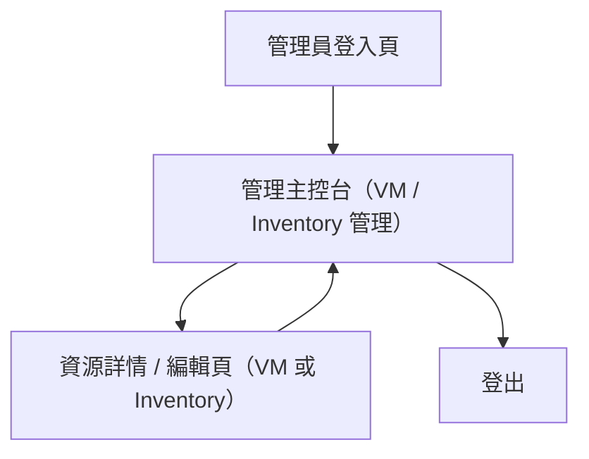

## 1. Product Overview
提供獨立於一般用戶介面的「管理員(Admin)主控台」，讓具權限的人員集中管理 VM 與 Ansible inventory（CRUD），並以 API 合約提供可被前端與未來自動化工具一致呼叫的介面。

## 2. Core Features

### 2.1 User Roles
| 角色 | 註冊/登入方式 | 核心權限 |
|------|----------------|----------|
| 系統管理員（Super Admin） | 由系統預先建立或以邀請碼建立；使用 Email/密碼登入 | 可管理管理員帳號與角色；可對 VM/Inventory 全域 CRUD |
| 管理員（Admin/Operator） | 由 Super Admin 邀請建立；使用 Email/密碼登入 | 可對 VM/Inventory CRUD；不可管理帳號與角色 |

### 2.2 Feature Module
本管理員主控台需求由以下主要頁面構成：
1. **管理員登入頁**：登入表單、錯誤提示、忘記密碼入口。
2. **管理主控台（VM / Inventory 管理）**：導覽與登出、VM 列表與 CRUD、Inventory 列表與 CRUD、權限提示。
3. **資源詳情 / 編輯頁（VM 或 Inventory）**：資源檢視、建立/編輯表單、刪除確認、變更紀錄（僅顯示最近 N 筆）。

### 2.3 Page Details
| Page Name | Module Name | Feature description |
|-----------|-------------|---------------------|
| 管理員登入頁 | 登入表單 | 驗證 Email/密碼並取得登入 Session；顯示錯誤訊息與重試 |
| 管理員登入頁 | 忘記密碼 | 觸發密碼重設信（導向重設流程） |
| 管理主控台（VM / Inventory 管理） | 全域導覽 | 顯示側邊欄（VM、Inventory、若有權限則顯示「管理員/角色」）；提供登出 |
| 管理主控台（VM / Inventory 管理） | VM 列表 | 列出 VM（分頁/排序/關鍵字搜尋）；顯示狀態、IP、標籤；可進入詳情 |
| 管理主控台（VM / Inventory 管理） | VM 建立/編輯入口 | 從列表啟動建立；從列表/詳情啟動編輯（表單驗證、送出、回饋） |
| 管理主控台（VM / Inventory 管理） | Inventory 列表 | 列出 Inventory（分頁/排序/搜尋）；顯示 host 數量、最後更新；可進入詳情 |
| 管理主控台（VM / Inventory 管理） | Inventory 建立/編輯入口 | 建立/編輯 Inventory 基本資料與 vars；管理 hosts（新增/編輯/刪除 host） |
| 管理主控台（VM / Inventory 管理） | 權限與稽核提示 | 在無權限操作時顯示「禁止」訊息；顯示當前登入角色 |
| 資源詳情 / 編輯頁（VM 或 Inventory） | 詳情檢視 | 顯示資源完整欄位；提供返回列表 |
| 資源詳情 / 編輯頁（VM 或 Inventory） | 編輯表單 | 以同頁切換「檢視/編輯」；做欄位驗證與保存；保存後更新畫面 |
| 資源詳情 / 編輯頁（VM 或 Inventory） | 刪除 | 需要二次確認；成功後返回列表 |
| 資源詳情 / 編輯頁（VM 或 Inventory） | 變更紀錄（最近 N 筆） | 顯示最近建立/更新/刪除動作（操作者、時間、動作、目標） |

## 3. Core Process
- Super Admin Flow：登入 → 進入管理主控台 → 管理 VM（查詢/建立/編輯/刪除）與 Inventory（含 hosts 與 vars）→（可選）進入「管理員/角色」管理 → 登出。
- Admin Flow：登入 → 進入管理主控台 → 管理 VM 與 Inventory（CRUD）→ 登出。

