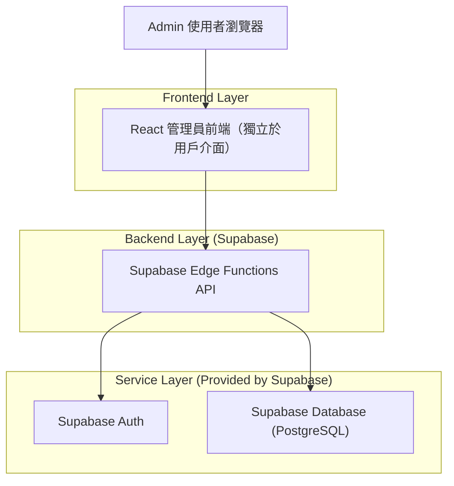
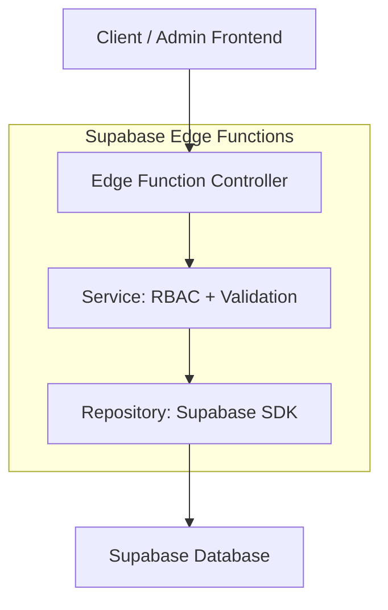
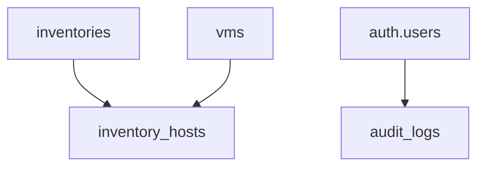

## 1.Architecture design


## 2.Technology Description
- Frontend: React@18 + TypeScript + vite + tailwindcss@3
- Backend: Supabase Edge Functions（提供 REST API 合約、權限驗證、輸入驗證）
- Auth: Supabase Auth（Email/Password）
- Database: Supabase (PostgreSQL)

## 3.Route definitions
| Route | Purpose |
|-------|---------|
| /admin/login | 管理員登入（獨立入口） |
| /admin | 管理主控台（VM/Inventory 列表與操作） |
| /admin/vms/:id | VM 詳情/編輯 |
| /admin/inventories/:id | Inventory 詳情/編輯 |

## 4.API definitions (If it includes backend services)
### 4.1 共用規範
- Auth：前端以 Supabase Auth 登入取得 access_token；呼叫 API 時帶 `Authorization: Bearer <token>`。
- 權限：Edge Function 解析 JWT（`app_metadata.role`）
  - `super_admin`：可管理全部資源 + 管理員/角色
  - `admin`：可 CRUD VM/Inventory；不可管理帳號與角色

### 4.2 TypeScript 型別（前後端共用）
```ts
export type Role = 'super_admin' | 'admin'

export type VMStatus = 'running' | 'stopped' | 'unknown'

export type VM = {
  id: string
  name: string
  provider?: string
  ip_address?: string
  status: VMStatus
  tags: string[]
  notes?: string
  created_at: string
  updated_at: string
}

export type Inventory = {
  id: string
  name: string
  description?: string
  vars: Record<string, any>
  created_at: string
  updated_at: string
}

export type InventoryHost = {
  id: string
  inventory_id: string
  hostname: string
  ansible_host?: string
  vm_id?: string
  vars: Record<string, any>
  created_at: string
  updated_at: string
}

export type AuditLog = {
  id: string
  actor_user_id: string
  actor_email?: string
  action: 'create' | 'update' | 'delete'
  target_type: 'vm' | 'inventory' | 'inventory_host'
  target_id: string
  created_at: string
}
```

### 4.3 Core API（REST）
VM
- `GET /api/v1/vms?query=&page=&pageSize=`
- `POST /api/v1/vms`
- `GET /api/v1/vms/:id`
- `PATCH /api/v1/vms/:id`
- `DELETE /api/v1/vms/:id`

Inventory
- `GET /api/v1/inventories?query=&page=&pageSize=`
- `POST /api/v1/inventories`
- `GET /api/v1/inventories/:id`
- `PATCH /api/v1/inventories/:id`
- `DELETE /api/v1/inventories/:id`

Inventory Hosts
- `GET /api/v1/inventories/:inventoryId/hosts`
- `POST /api/v1/inventories/:inventoryId/hosts`
- `PATCH /api/v1/inventories/:inventoryId/hosts/:hostId`
- `DELETE /api/v1/inventories/:inventoryId/hosts/:hostId`

Audit (read-only)
- `GET /api/v1/audit?targetType=&targetId=&page=&pageSize=`

## 5.Server architecture diagram (If it includes backend services)


## 6.Data model(if applicable)

### 6.1 Data model definition


### 6.2 Data Definition Language
VM 表（vms）
```sql
CREATE TABLE vms (
  id UUID PRIMARY KEY DEFAULT gen_random_uuid(),
  name TEXT NOT NULL,
  provider TEXT,
  ip_address TEXT,
  status TEXT NOT NULL DEFAULT 'unknown',
  tags TEXT[] NOT NULL DEFAULT '{}',
  notes TEXT,
  created_at TIMESTAMPTZ NOT NULL DEFAULT NOW(),
  updated_at TIMESTAMPTZ NOT NULL DEFAULT NOW()
);
CREATE INDEX idx_vms_name ON vms (name);
CREATE INDEX idx_vms_status ON vms (status);

GRANT SELECT ON vms TO anon;
GRANT ALL PRIVILEGES ON vms TO authenticated;
```

Inventory 表（inventories）
```sql
CREATE TABLE inventories (
  id UUID PRIMARY KEY DEFAULT gen_random_uuid(),
  name TEXT NOT NULL,
  description TEXT,
  vars JSONB NOT NULL DEFAULT '{}'::jsonb,
  created_at TIMESTAMPTZ NOT NULL DEFAULT NOW(),
  updated_at TIMESTAMPTZ NOT NULL DEFAULT NOW()
);
CREATE INDEX idx_inventories_name ON inventories (name);

GRANT SELECT ON inventories TO anon;
GRANT ALL PRIVILEGES ON inventories TO authenticated;
```

Inventory Host 表（inventory_hosts）
```sql
CREATE TABLE inventory_hosts (
  id UUID PRIMARY KEY DEFAULT gen_random_uuid(),
  inventory_id UUID NOT NULL,
  hostname TEXT NOT NULL,
  ansible_host TEXT,
  vm_id UUID,
  vars JSONB NOT NULL DEFAULT '{}'::jsonb,
  created_at TIMESTAMPTZ NOT NULL DEFAULT NOW(),
  updated_at TIMESTAMPTZ NOT NULL DEFAULT NOW()
);
CREATE INDEX idx_inventory_hosts_inventory_id ON inventory_hosts (inventory_id);
CREATE INDEX idx_inventory_hosts_hostname ON inventory_hosts (hostname);

GRANT SELECT ON inventory_hosts TO anon;
GRANT ALL PRIVILEGES ON inventory_hosts TO authenticated;
```

稽核表（audit_logs）
```sql
CREATE TABLE audit_logs (
  id UUID PRIMARY KEY DEFAULT gen_random_uuid(),
  actor_user_id UUID NOT NULL,
  actor_email TEXT,
  action TEXT NOT NULL,
  target_type TEXT NOT NULL,
  target_id UUID NOT NULL,
  created_at TIMESTAMPTZ NOT NULL DEFAULT NOW()
);
CREATE INDEX idx_audit_logs_target ON audit_logs (target_type, target_id, created_at DESC);

GRANT SELECT ON audit_logs TO anon;
GRANT ALL PRIVILEGES ON audit_logs TO authenticated;
```

RLS（概念）
- 對上述表啟用 RLS：
  - `authenticated` 且 `role in ('admin','super_admin')` 允許 CRUD
  - `role = 'super_admin'` 才允許「管理員/角色」相關資源（若日後擴充）
- Edge Functions 仍需做二次 RBAC 檢查（避免僅靠前端控管）。
