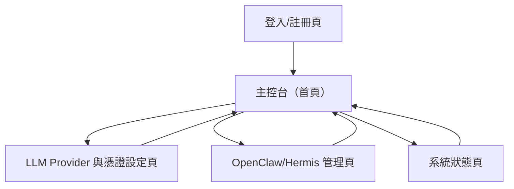

## 1. Product Overview
OpenClaw 設定網站提供「多用戶登入」的集中式管理介面，讓每位使用者可設定 LLM Provider（含 OpenRouter）並管理整合憑證。
同時提供 OpenClaw/Hermis 的基本維運操作（skills 管理、重裝、重啟）與系統狀態檢視。

## 2. Core Features

### 2.1 User Roles
| 角色 | 註冊方式 | 核心權限 |
|------|----------|----------|
| 使用者 | 手機號碼 + OTP 驗證碼登入（不使用 Email） | 可設定個人 LLM provider 與憑證；可操作 OpenClaw/Hermis 管理功能；可檢視系統狀態 |

### 2.2 Feature Module
本產品需求由以下主要頁面構成：
1. **登入/註冊頁**：登入、註冊、忘記密碼（如採用）、登入狀態導引。
2. **主控台（首頁）**：導覽入口、目前選用的 LLM provider 摘要、OpenClaw/Hermis 狀態摘要與快捷操作。
3. **LLM Provider 與憑證設定頁**：選擇 provider（含 OpenRouter）、新增/更新/刪除整合憑證、（可選）憑證有效性測試。
4. **OpenClaw/Hermis 管理頁**：skills 清單與啟用狀態、skills 安裝/移除、服務重啟、服務重裝。
5. **系統狀態頁**：系統/服務健康度、關鍵指標與最新錯誤摘要（僅展示）。

### 2.3 Page Details
| Page Name | Module Name | Feature description |
|---|---|---|
| 登入/註冊頁 | 身份驗證 | 提供手機號碼登入（E.164）與 OTP 驗證碼；登入成功後導向主控台；顯示錯誤訊息與狀態（例如號碼格式錯誤、驗證碼錯誤、發送失敗）。 |
| 主控台（首頁） | 導覽與摘要 | 顯示主要功能入口；顯示「目前選用 provider」與最後更新時間；顯示 OpenClaw/Hermis 狀態摘要（運行中/停止/異常）與前往操作入口。 |
| LLM Provider 與憑證設定頁 | Provider 選擇 | 列出可用 provider（至少含 OpenRouter）；允許每位使用者選擇 1 個預設 provider；儲存並回到摘要。 |
| LLM Provider 與憑證設定頁 | 憑證管理 | 讓使用者新增/更新/刪除該 provider 需要的憑證（例如 API Key）；遮罩顯示敏感值；（可選）提供「測試連線」並回傳成功/失敗原因。 |
| OpenClaw/Hermis 管理頁 | Skills 管理 | 顯示 skills 清單、版本與狀態；提供安裝/移除/啟用/停用（以你的實作為準）並顯示操作結果。 |
| OpenClaw/Hermis 管理頁 | 維運操作 | 提供 OpenClaw 與 Hermis 的「重啟」與「重裝」操作；操作需二次確認；顯示進度與完成/失敗訊息。 |
| 系統狀態頁 | 健康度與指標 | 顯示系統健康度（OK/Warn/Critical）；顯示服務狀態、資源使用摘要（CPU/記憶體/磁碟等以你的可觀測性為準）；顯示最新錯誤摘要（僅讀取）。 |

## 3. Core Process
- 使用者流程：
  1) 使用者在登入/註冊頁完成登入。
  2) 進入主控台查看目前 provider 與系統摘要。
  3) 前往「LLM Provider 與憑證設定」選擇 provider（含 OpenRouter）並建立/更新憑證。
  4) 前往「OpenClaw/Hermis 管理」進行 skills 管理，必要時執行重啟/重裝。
  5) 在「系統狀態」頁持續檢視健康度與錯誤摘要。

