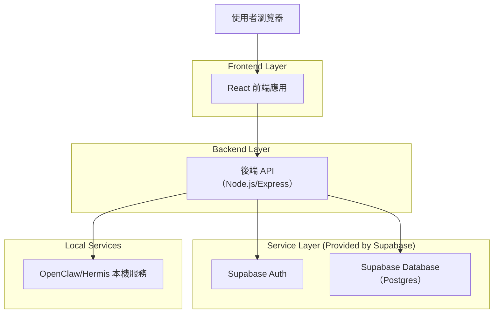
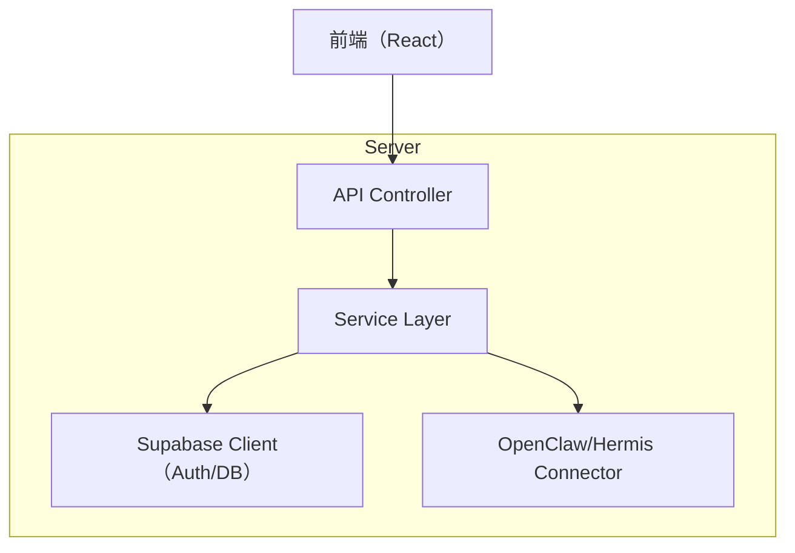
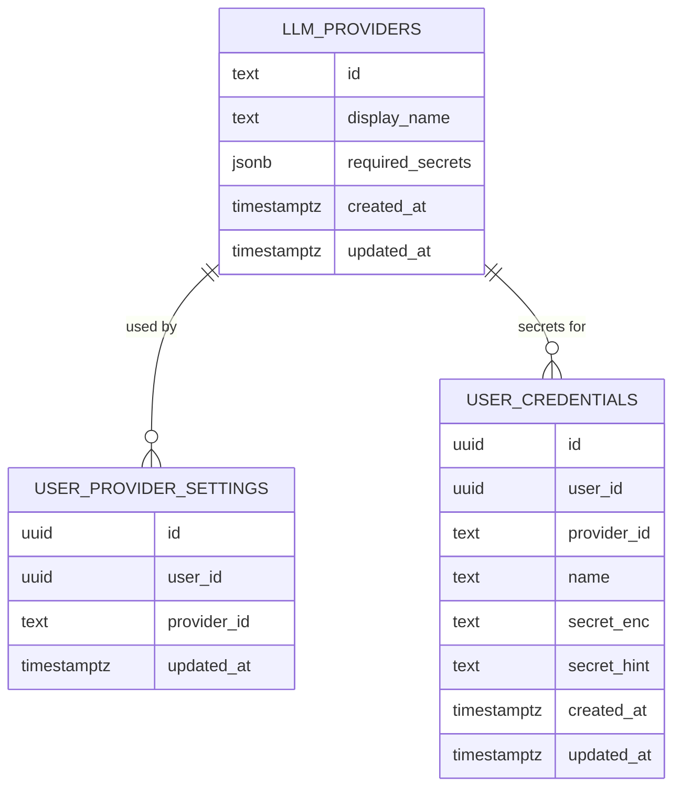

## 1.Architecture design


## 2.Technology Description
- Frontend: React@18 + react-router + tailwindcss@3 + vite
- Backend: Node.js + Express@4（提供 API、串接 OpenClaw/Hermis、集中處理敏感憑證）
- Database/Auth: Supabase（Auth + Postgres）

## 3.Route definitions
| Route | Purpose |
|---|---|
| /login | 使用者登入 |
| /register | 使用者註冊 |
| /app | 主控台（摘要與導覽） |
| /app/providers | LLM provider 與憑證設定 |
| /app/agents | OpenClaw/Hermis 管理（skills/重裝/重啟） |
| /app/status | 系統狀態 |

## 4.API definitions
### 4.1 Core API
Authentication
```
POST /api/auth/register
POST /api/auth/login
POST /api/auth/logout
GET  /api/me
```

Provider & Credentials
```
GET  /api/providers
GET  /api/user/provider
PUT  /api/user/provider
GET  /api/user/credentials
POST /api/user/credentials
PUT  /api/user/credentials/:credentialId
DELETE /api/user/credentials/:credentialId
POST /api/user/credentials/:credentialId/test
```

OpenClaw/Hermis 管理
```
GET  /api/agents/status
GET  /api/agents/:agent/skills
POST /api/agents/:agent/skills/install
POST /api/agents/:agent/skills/remove
POST /api/agents/:agent/restart
POST /api/agents/:agent/reinstall
```

系統狀態
```
GET /api/system/status
```

### 4.2 Shared TypeScript types（前後端共用）
```ts
type AgentName = "openclaw" | "hermis";

type LlmProviderId = "openrouter" | string;

type LlmProvider = {
  id: LlmProviderId;
  displayName: string;
  requiredSecrets: Array<{ key: string; label: string; masked: boolean }>;
};

type UserProviderSetting = {
  userId: string; // UUID
  providerId: LlmProviderId;
  updatedAt: string; // ISO
};

type UserCredential = {
  id: string; // UUID
  userId: string; // UUID
  providerId: LlmProviderId;
  name: string; // 例如 "OpenRouter Key"
  secretMasked: string; // 例如 "sk-****abcd"
  createdAt: string;
  updatedAt: string;
};

type AgentStatus = {
  agent: AgentName;
  status: "running" | "stopped" | "error";
  message?: string;
};

type SystemStatus = {
  overall: "ok" | "warn" | "critical";
  agents: AgentStatus[];
  resources?: { cpuPct?: number; memPct?: number; diskPct?: number };
  latestErrors?: Array<{ at: string; source: string; message: string }>;
};
```

## 5.Server architecture diagram


## 6.Data model
### 6.1 Data model definition


### 6.2 Data Definition Language
LLM Providers（llm_providers）
```sql
CREATE TABLE llm_providers (
  id TEXT PRIMARY KEY,
  display_name TEXT NOT NULL,
  required_secrets JSONB NOT NULL DEFAULT '[]',
  created_at TIMESTAMPTZ NOT NULL DEFAULT NOW(),
  updated_at TIMESTAMPTZ NOT NULL DEFAULT NOW()
);

GRANT SELECT ON llm_providers TO anon;
GRANT ALL PRIVILEGES ON llm_providers TO authenticated;

INSERT INTO llm_providers (id, display_name, required_secrets)
VALUES (
  'openrouter',
  'OpenRouter',
  '[{"key":"apiKey","label":"API Key","masked":true}]'
);
```

每用戶 Provider 設定（user_provider_settings）
```sql
CREATE TABLE user_provider_settings (
  id UUID PRIMARY KEY DEFAULT gen_random_uuid(),
  user_id UUID NOT NULL,
  provider_id TEXT NOT NULL,
  updated_at TIMESTAMPTZ NOT NULL DEFAULT NOW()
);

CREATE INDEX idx_user_provider_settings_user_id ON user_provider_settings(user_id);

GRANT SELECT ON user_provider_settings TO anon;
GRANT ALL PRIVILEGES ON user_provider_settings TO authenticated;
```

每用戶憑證（user_credentials）
```sql
-- secret_enc 用於存放「加密後」的敏感值（由後端加/解密），secret_hint 用於 UI 遮罩顯示
CREATE TABLE user_credentials (
  id UUID PRIMARY KEY DEFAULT gen_random_uuid(),
  user_id UUID NOT NULL,
  provider_id TEXT NOT NULL,
  name TEXT NOT NULL,
  secret_enc TEXT NOT NULL,
  secret_hint TEXT NOT NULL,
  created_at TIMESTAMPTZ NOT NULL DEFAULT NOW(),
  updated_at TIMESTAMPTZ NOT NULL DEFAULT NOW()
);

CREATE INDEX idx_user_credentials_user_id ON user_credentials(user_id);

GRANT SELECT ON user_credentials TO anon;
GRANT ALL PRIVILEGES ON user_credentials TO authenticated;
```

備註：建議啟用 Supabase RLS，並限制 `user_id = auth.uid()` 的資料列可被存取；敏感值的加/解密金鑰需放在後端環境變數，避免在前端暴露。