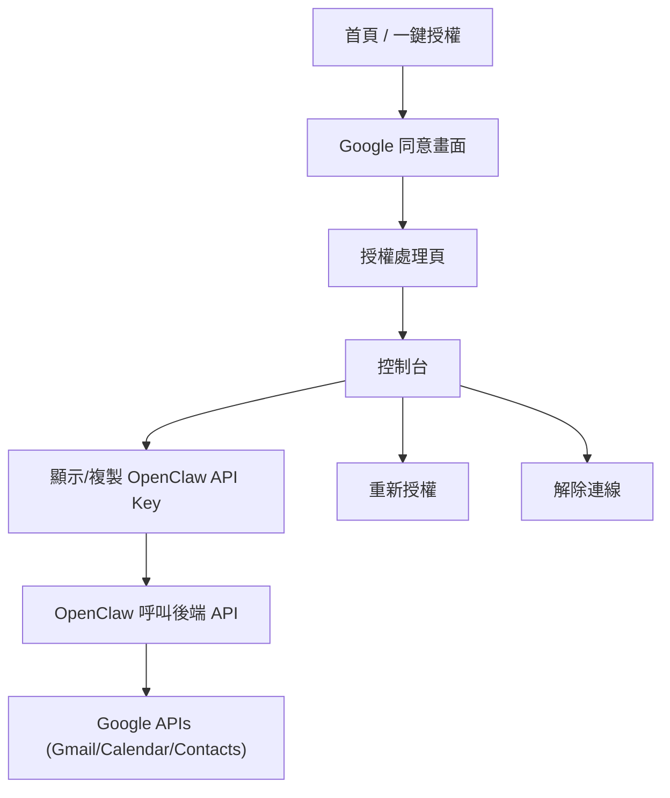

## 1. Product Overview
提供一個極簡網頁介面，讓電腦小白「一鍵用 Google 授權」並完成 Gmail / Calendar / Contacts 存取授權。
授權完成後，後端以安全 API 形式提供給 OpenClaw 呼叫，代你讀取信件、行事曆與聯絡人。

## 2. Core Features

### 2.1 User Roles
| 角色 | 註冊/登入方式 | 核心權限 |
|------|---------------|----------|
| 一般使用者 | 以 Google OAuth 授權即視為登入（無額外註冊） | 檢視連線狀態、重新授權/解除連線、取得給 OpenClaw 使用的 API Key |
| OpenClaw（系統呼叫方） | 以 API Key 驗證 | 以使用者授權範圍內，讀取 Gmail/Calendar/Contacts（只讀） |

### 2.2 Feature Module
本產品最小可行需求包含以下頁面：
1. **首頁 / 一鍵授權頁**：產品說明、開始授權按鈕、常見問題（為小白設計）。
2. **授權處理頁**：顯示「正在完成授權」與錯誤提示、導回控制台。
3. **控制台（連線與 OpenClaw 設定）**：顯示授權狀態、顯示/複製 API Key、重新授權、解除連線、測試呼叫（可選擇性以簡單按鈕觸發）。

### 2.3 Page Details
| Page Name | Module Name | Feature description |
|-----------|-------------|---------------------|
| 首頁 / 一鍵授權頁 | 產品導覽與信任資訊 | 說明會存取的 Google 服務（Gmail/Calendar/Contacts）與用途、提示只讀/最小權限、提供「開始用 Google 授權」入口 |
| 首頁 / 一鍵授權頁 | 一鍵授權 | 點擊後導向 Google 同意畫面；必要時提示使用者選擇帳號 |
| 首頁 / 一鍵授權頁 | 常見問題/排錯 | 引導使用者遇到「沒有成功」「看不到資料」「要換帳號」時怎麼做（重新授權/解除連線） |
| 授權處理頁 | 授權完成/失敗狀態 | 顯示處理中、成功（自動導去控制台）、失敗（顯示原因與重試按鈕） |
| 控制台 | 連線狀態 | 顯示目前 Google 帳號、各服務授權狀態（Gmail/Calendar/Contacts）、最後同步/最後成功呼叫時間（若可得） |
| 控制台 | OpenClaw API Key | 顯示與一鍵複製 API Key；提供「重置/輪替 API Key」並提醒會影響 OpenClaw 設定 |
| 控制台 | 重新授權/解除連線 | 重新觸發授權流程以補齊權限；解除連線會撤銷本系統保存的 refresh token 並使 API Key 失效（或標記停用） |
| 控制台 | 最小測試工具 | 以按鈕觸發簡單測試（例如：列出最近 5 封信主旨/最近 5 筆行事曆/搜尋一筆聯絡人），只呈現必要摘要與錯誤訊息 |

## 3. Core Process
**使用者流程**
1. 你進入首頁，閱讀「會存取哪些 Google 資料」與注意事項。
2. 你點「開始用 Google 授權」，在 Google 同意畫面選擇帳號並同意授權。
3. 系統完成授權後導回控制台，你會看到連線狀態與可複製的 OpenClaw API Key。
4. 你把 API Key 設到 OpenClaw；之後 OpenClaw 以 API Key 呼叫後端，後端用你的 Google 授權代你讀取 Gmail/Calendar/Contacts。

**OpenClaw 呼叫流程**
1. OpenClaw 以 API Key 呼叫後端讀取資料。
2. 後端驗證 API Key → 找到對應使用者 → 使用保存的 refresh token 取得 access token（必要時自動更新）→ 呼叫 Google API → 回傳結果給 OpenClaw。

