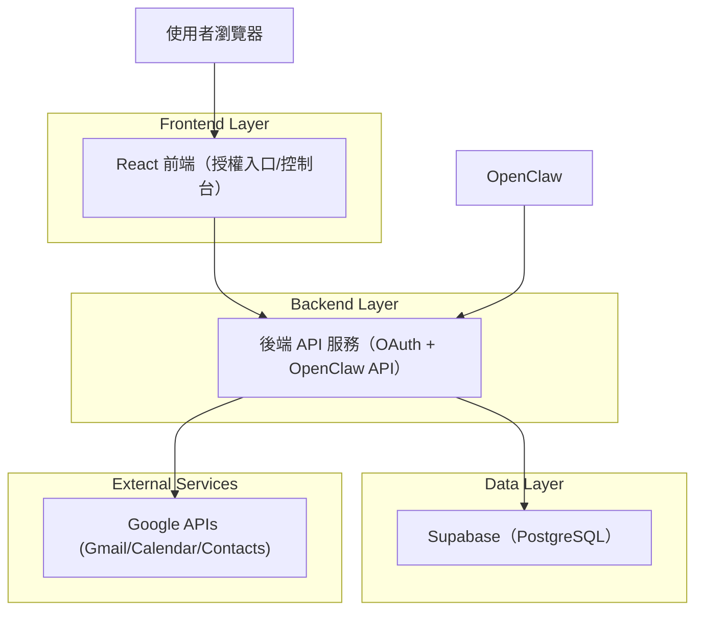
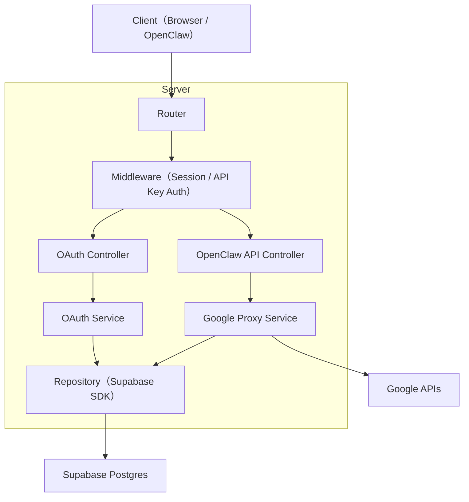
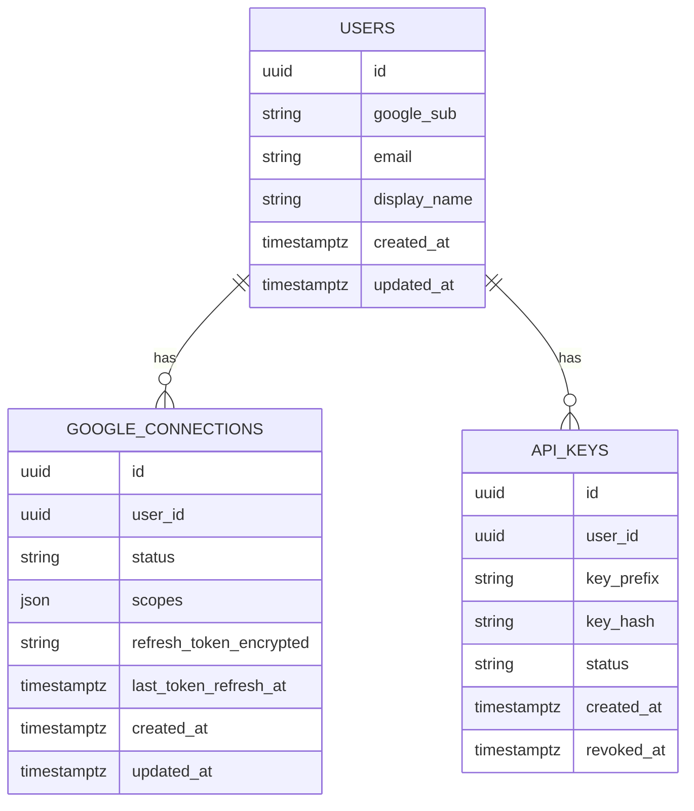

## 1.Architecture design


## 2.Technology Description
- Frontend: React@18 + TypeScript + vite + tailwindcss@3
- Backend: Node.js + Express@4（TypeScript）
- Database: Supabase（PostgreSQL）
- Google integration: google-auth-library + Google APIs（Gmail/Calendar/People）

## 3.Route definitions
| Route | Purpose |
|-------|---------|
| / | 首頁：一鍵授權入口、說明與排錯 |
| /oauth/processing | 授權回跳處理中/結果頁（前端顯示狀態） |
| /dashboard | 控制台：連線狀態、API Key、重新授權/解除連線 |

## 4.API definitions
### 4.1 Core types（TypeScript）
```ts
type Provider = "google";

type ConnectionStatus = "connected" | "disconnected" | "error";

type ApiKeyStatus = "active" | "revoked";

type GoogleScopes = {
  gmailReadonly: boolean;
  calendarReadonly: boolean;
  contactsReadonly: boolean;
};

type User = {
  id: string; // uuid
  google_sub: string; // stable Google user id
  email: string;
  display_name: string | null;
  created_at: string;
};

type GoogleConnection = {
  id: string;
  user_id: string;
  status: ConnectionStatus;
  scopes: GoogleScopes;
  refresh_token_encrypted: string; // encrypted at rest
  last_token_refresh_at: string | null;
  updated_at: string;
};

type ApiKey = {
  id: string;
  user_id: string;
  key_prefix: string; // for display
  key_hash: string;   // store hash only
  status: ApiKeyStatus;
  created_at: string;
  revoked_at: string | null;
};
```

### 4.2 User-facing（瀏覽器）
啟動 Google OAuth（後端產生 state + PKCE、設定 access_type=offline 以取得 refresh token）
```
GET /api/oauth/google/start
```
Google OAuth callback（完成 token exchange、保存 refresh token、建立/更新使用者與連線狀態）
```
GET /api/oauth/google/callback
```
取得目前控制台資料（以後端 session cookie 驗證）
```
GET /api/me
```
輪替 API Key（以後端 session cookie 驗證）
```
POST /api/api-keys/rotate
```
解除連線（刪除/撤銷本系統保存的 refresh token，並使 API Key 失效或標記停用）
```
POST /api/connections/google/revoke
```

### 4.3 OpenClaw-facing（以 API Key 驗證）
Headers:
- `x-api-key: <your_key>`

Gmail（只讀）
```
GET /v1/gmail/messages?query=&maxResults=
GET /v1/gmail/messages/:id
```
Calendar（只讀）
```
GET /v1/calendar/events?calendarId=primary&timeMin=&timeMax=&maxResults=
```
Contacts/People（只讀）
```
GET /v1/contacts/search?query=&pageSize=
```

## 5.Server architecture diagram


## 6.Data model(if applicable)

### 6.1 Data model definition


### 6.2 Data Definition Language
users
```
CREATE TABLE users (
  id UUID PRIMARY KEY DEFAULT gen_random_uuid(),
  google_sub TEXT UNIQUE NOT NULL,
  email TEXT UNIQUE NOT NULL,
  display_name TEXT,
  created_at TIMESTAMPTZ NOT NULL DEFAULT NOW(),
  updated_at TIMESTAMPTZ NOT NULL DEFAULT NOW()
);
CREATE INDEX idx_users_google_sub ON users(google_sub);
```

google_connections
```
CREATE TABLE google_connections (
  id UUID PRIMARY KEY DEFAULT gen_random_uuid(),
  user_id UUID NOT NULL,
  status TEXT NOT NULL CHECK (status IN ('connected','disconnected','error')),
  scopes JSONB NOT NULL DEFAULT '{}'::jsonb,
  refresh_token_encrypted TEXT NOT NULL,
  last_token_refresh_at TIMESTAMPTZ,
  created_at TIMESTAMPTZ NOT NULL DEFAULT NOW(),
  updated_at TIMESTAMPTZ NOT NULL DEFAULT NOW()
);
CREATE INDEX idx_google_connections_user_id ON google_connections(user_id);
```

api_keys
```
CREATE TABLE api_keys (
  id UUID PRIMARY KEY DEFAULT gen_random_uuid(),
  user_id UUID NOT NULL,
  key_prefix TEXT NOT NULL,
  key_hash TEXT UNIQUE NOT NULL,
  status TEXT NOT NULL CHECK (status IN ('active','revoked')),
  created_at TIMESTAMPTZ NOT NULL DEFAULT NOW(),
  revoked_at TIMESTAMPTZ
);
CREATE INDEX idx_api_keys_user_id ON api_keys(user_id);
```

Supabase 權限（建議最小化）
```
GRANT SELECT ON users, google_connections, api_keys TO anon;
GRANT ALL PRIVILEGES ON users, google_connections, api_keys TO authenticated;
```

安全性備註（實作重點）
- refresh token 必須加密後再落庫（例如 AES-GCM；金鑰放在伺服器環境變數/密鑰管理）。
- OpenClaw API Key 僅保存雜湊（例如 SHA-256 + salt），回傳給使用者只在建立/輪替當下顯示一次。
- OpenClaw 端只允許「只讀」對 Google 資料的代理呼叫；必要時在後端白名單限制可用的 Google API 與欄位。